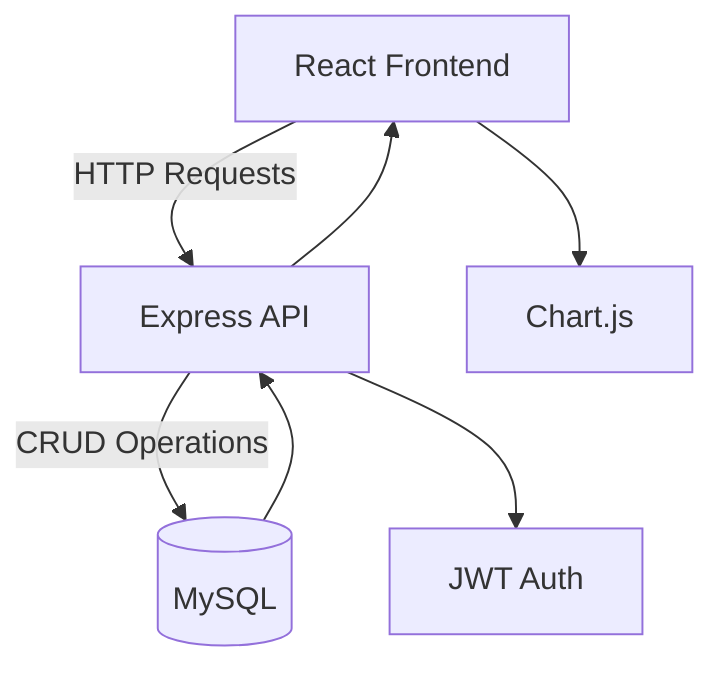

# Daystar Daycare Center Management System

  
*A web-based solution for efficient daycare operations, built with React.js and Express.js.*

---

## 📌 Table of Contents
- [Project Overview](#-project-overview)
- [Features](#-features)
- [Technology Stack](#-technology-stack)
- [System Architecture](#-system-architecture)
- [Database Schema](#-database-schema)
- [Setup & Installation](#-setup--installation)
- [Milestone Plan](#-milestone-plan)
- [Contributors](#-contributors)
- [License](#-license)

---

## 🌟 Project Overview
**Daystar Daycare Center** requires a robust management system to automate:
- Babysitter registration, scheduling, and payments  
- Child enrollment and attendance tracking  
- Financial management (income/expenses, budgeting)  
- Real-time notifications for parents and staff  

This project is part of the **CSC2210 Web Programming** exam (Easter 2025 Semester) at Uganda Christian University.

---

## ✨ Features
### Functional Requirements
| Module               | Key Features                                                                 |
|----------------------|-----------------------------------------------------------------------------|
| **Babysitter Mgmt**  | Registration (NIN validation), payment calculation, scheduling               |
| **Child Mgmt**       | Enrollment (special needs tracking), attendance, incident reporting          |
| **Financial Mgmt**   | Income/expense tracking, budget alerts, PDF/CSV exports                     |
| **Notifications**    | Automated SMS/email alerts for payments, incidents, and budget thresholds   |

### Non-Functional Requirements
- 🔒 **Security**: JWT authentication, encrypted data storage  
- ⚡ **Performance**: Real-time updates, responsive UI  
- 🗃️ **Scalability**: PostgreSQL database with Sequelize ORM  

---

## 🛠️ Technology Stack
| Layer          | Technology                                                                 |
|----------------|---------------------------------------------------------------------------|
| **Frontend**   | React.js, Bootstrap, Chart.js, Axios                                      |
| **Backend**    | Express.js, JWT, Bcrypt                                                   |
| **Database**   | PostgreSQL (hosted on Supabase/Heroku)                                    |
| **DevOps**     | GitHub (version control), Vercel (frontend), Render (backend)             |

---

## 🏗️ System Architecture


---

## 🗃️ Database Schema
  
*Key Tables:*
- `Users` (Managers/Babysitters)  
- `Children` (with parent contacts)  
- `Attendance`, `Incidents`, `Payments`, `FinancialRecords`  

---

## 🚀 Setup & Installation
### Prerequisites
- Node.js (v16+)
- PostgreSQL (v12+)
- Git

### Steps
1. **Clone the repository**:
   ```bash
   https://github.com/YAS-1/Daystar_Daycare
   cd daystar-daycare
   ```

2. **Set up backend**:
   ```bash
   cd server
   npm install
   cp .env.example .env  # Configure database credentials
   npm run dev
   ```

3. **Set up frontend**:
   ```bash
   cd ../client
   npm install
   npm start
   ```

4. **Access the app**:
   - Frontend: `http://localhost:3000`  
   - API: `http://localhost:5000`  

---

## 📅 Milestone Plan
| Milestone           | Focus Area                          | Deliverables                              |
|---------------------|-------------------------------------|-------------------------------------------|
| **1 (Current)**     | Research & Design                   | Architecture docs, wireframes, ER diagram |
| **2**               | Core Functionality                  | Auth system, registration forms           |
| **3**               | Advanced Features                  | Payments, notifications, reporting       |
| **4**               | Optimization                       | Performance tuning, security fixes        |
| **5**               | Documentation                      | Final report, presentation, demo video    |

---

## 👥 Contributors
- [Your Name] (@your-github)  
- [Team Member 2] (@github-handle)  
*Uganda Christian University, BSc Computer Science 2025*

---

## 📜 License
This project is licensed under the **MIT License**. See [LICENSE](LICENSE) for details.

---

*© 2025 Daystar Daycare Center | Exam Project for UCU CSC2210 Web Programming*  
*"A Complete Education for a Complete Person"*
```
